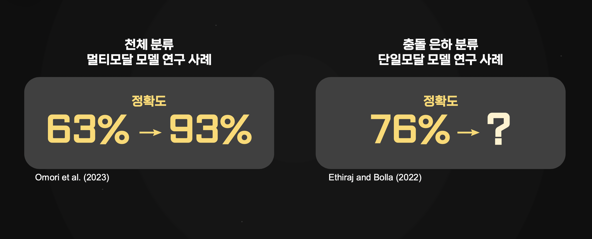
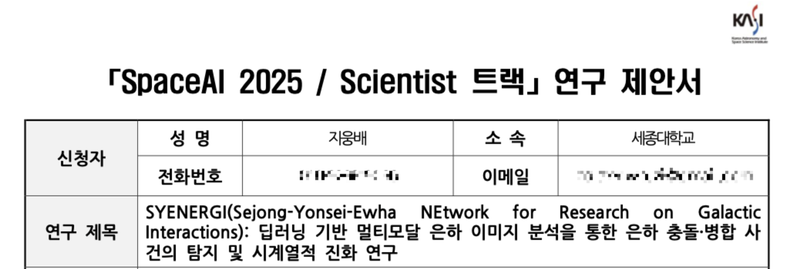
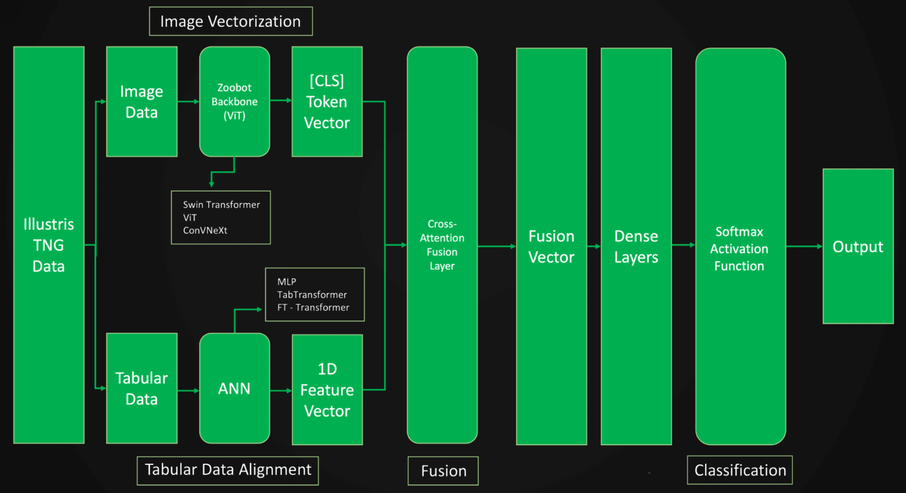
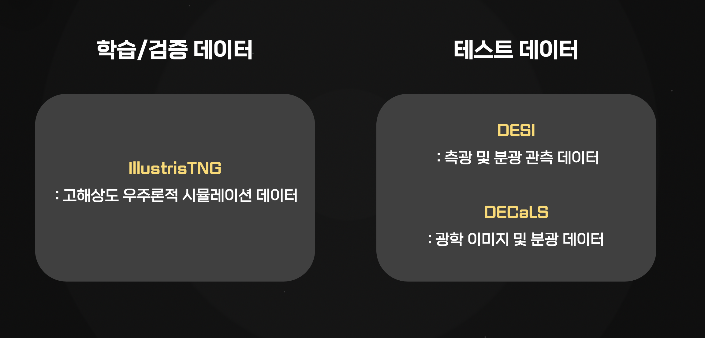

# 🌌 MultimodalAI Model for Classifying Galaxy Mergers 🌌 

🔭 캡스톤 스타트 : 우주정복 7팀 

<small> 이미지 출처 : Kurzgesagt – In a Nutshell </small>

<b> 은하 병합 여부를 분류하는 멀티모달 AI 모델 연구 개발 </b>
  
겉보기엔 고립된 은하처럼 보이지만 실제로는 병합 이력을 숨기고 있는 은하들 즉, post-merger imposter 은하를 찾아내는 멀티모달 AI 모델을 개발한다. 이를 위해 은하 이미지와 물리량(질량, 속도, 별 형성률 등)을 결합해 병합 전/중/직후/후 단계를 자동으로 분류하고, 시계열적 병합 이력까지 추정할 수 있는 AI 기반 은하 병합 탐지 시스템을 구축한다.
 

<!-- 성과 칸 -->
  
🏆 한국천문연구원 SpaceAI 2025 연구 과제 선정  
🏆 ???
  

## 🌌 연구 팀

### 🔭 우주정복 캡스톤 7팀

<table style="width: 100%;"> 
  <tr>
    <tr>
    <th>정은채 
    <a href="https://github.com/Goldchae" target="_blank">(Goldchae)</a>
    </th>
  </tr>
  </tr>
  <tr>
    <td> 한 일 </td>
  </tr>
</table>

<table style="width: 100%;"> 
  <tr>
    <tr>
    <th>정은채 
    <a href="https://github.com/Goldchae" target="_blank">(Goldchae)</a>
    </th>
  </tr>
  </tr>
  <tr>
    <td> 한 일 </td>
  </tr>
</table>

 
 

### 🔭 SYENERGI ( 세종-연세-이화 은하 상호작용 연구 네트워크 )

<table style="width: 100%;"> 
  <tr>
    <tr>
    <th>정은채 
    <a href="https://github.com/Goldchae" target="_blank">(Goldchae)</a>
    </th>
  </tr>
  </tr>
  <tr>
    <td> 한 일 </td>
  </tr>
</table>

 
 

### 🔭 서울대 황호성 교수님 랩실 서버 자원 지원
- 

 
 
 

## 🌌 연구 상세

### 🔭 아키텍처 

### 🔭 데이터

### TNG
TNG50-1 데이터

-  병합 은하(Merger): 
조건 : SnapNumLastMerger가 현재 snapshot 기준 0.5 Gyr 이내인 경우
개수 : 개 

- 비병합 은하(Non-merger):
조건 : 병합 이력이 없거나 SnapNumLastMerger가 너무 오래 전인 경우
개수: 개 

 
 
 

## 🌌 연구 진행 노트

<table style="width: 100%;  border: 3px solid Blue;  ">
  <tr>
    <td>
      <h3>v1.0.0 (2025-3-)</h3>
      <ul>
        <li><strong>아키텍처</strong>: late fusion, 물리량부- MLP, 이미지부 - zoobot ??  </li>
        <li><strong>데이터</strong>: 물리량 랜덤값 세팅 </li>
        <li><strong>기타</strong>: </li>
      </ul>
    </td>
  </tr>
  <tr>
    <td>
      <h3>v1.x.x (추후 업데이트 예정)</h3>
      <ul>
        <li><strong>개선한 사항</strong>: </li>
        <li><strong>최적화 내용</strong>: </li>
      </ul>
    </td>
  </tr>
</table>

